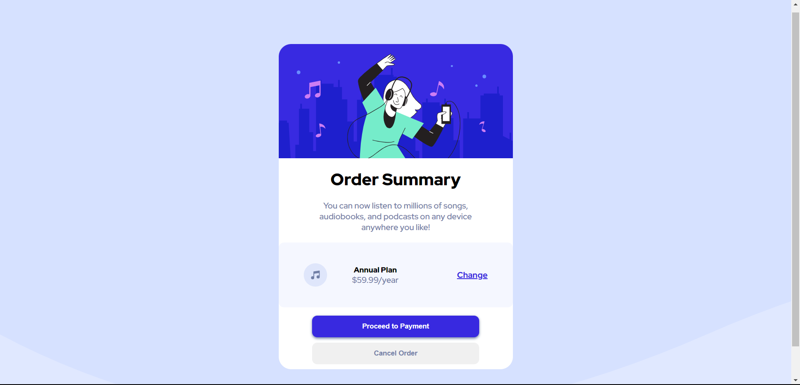
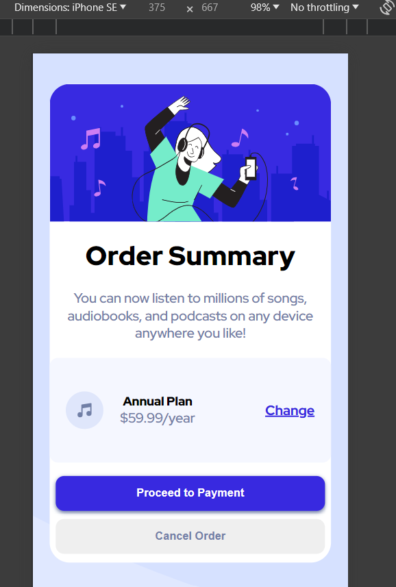

# Frontend Mentor - Order summary card solution

This is a solution to the [Order summary card challenge on Frontend Mentor](https://www.frontendmentor.io/challenges/order-summary-component-QlPmajDUj). Frontend Mentor challenges help you improve your coding skills by building realistic projects.

## Table of contents

- [Overview](#overview)
  - [The challenge](#the-challenge)
  - [Screenshot](#screenshot)
  - [Links](#links)
- [My process](#my-process)
  - [Built with](#built-with)
  - [What I learned](#what-i-learned)
  - [Continued development](#continued-development)
  - [Useful resources](#useful-resources)
- [Author](#author)

## Overview

### The challenge

Users should be able to:

- See hover states for interactive elements

### Screenshot




### Links

- Solution URL: ()
- Live Site URL: ()

### Built with

- Semantic HTML5 markup
- CSS custom properties
- Flexbox
- Google Fonts
- Media Queries

### What I learned

I practiced my media queries skills effeciently that added some extra responsiveness to my component. This allowed me to create the mobile design correctly.

Also i practiced my responsiveness problem solving skills by making this fully responsive alone.

```
.card {
    background-color: white;
    margin: 6rem auto;
    max-width: 450px;
    border-radius: 1.5rem;
}

@media (max-width: 500px) {
    .card {
        margin-left: 20px;
        margin-right: 20px;
    }
}
```

### Continued development

- I want to learn more about css by creating multi-page websites

### Useful resources

- (https://www.w3schools.com) - W3S helped me getting some help!

## Author

- Frontend Mentor - [@hassanmoaa](https://www.frontendmentor.io/profile/hassanmoaa)
